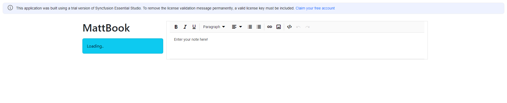

# MattBook - Note Taking App (WIP)

## Intro
This is a Note Taking app written in Java 11 and Angular 15. It's still a work in progress.

## Implemented so far
 * Java JPA/H2 database created and initialised with sample data -
   *  Note model and Repository created
   *  REST endpoint is automatically created by spring-boot-starter-data-rest
 * Angular components created
   * note-preview
   * note-list
   * editor - using SyncFusion Rich Text editor lib

## Still to do
 * Fix/finish notes-list (GET all) functionality
   * Strip HTML content (i.e. what the RTE lib will send to server) out of notes-preview to just the text content.
 * Add POST/PUT/DELETE functionality for notes on UI - 
   * interface with Java rest controller and add ui new/save/delete buttons