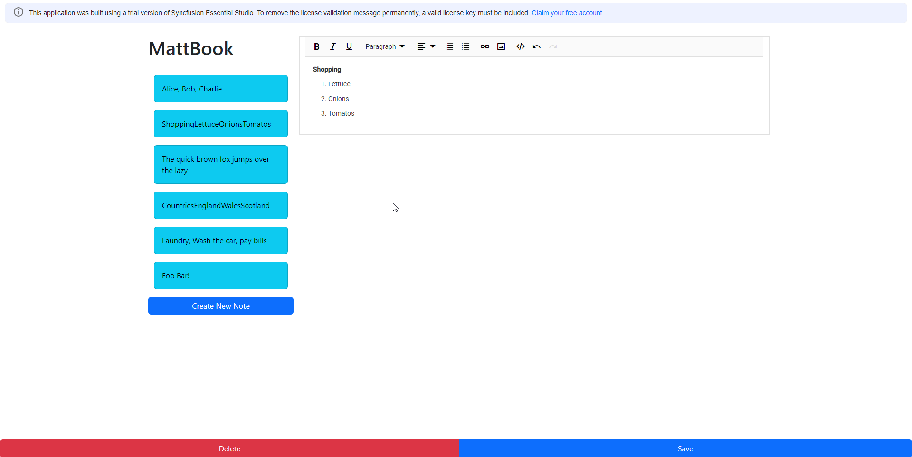

# MattBook - Note Taking App

## Intro
This is a Note Taking app written in Java 11 and Angular 15.

## Implemented so far
 * Java JPA/H2 database created and initialised with sample data -
   *  Note model and Repository created
   *  REST endpoint is automatically created by spring-boot-starter-data-rest
 * Angular components created
   * note-preview
   * note-list
   * editor - using SyncFusion Rich Text editor lib
 * Basic styling in place
 * Inter-component event messaging using Subject observables
 * GET all functionality to populate a list of notes from the server
 * CREATE, POST, PUT, DELETE note functionality

## With more time, I would..
 * Write tests - ui and backend
 * Improve UI design 😊
 * Write Error Handling
 * Probably persist the note database to a file
 * There's a small bug that the first 5 (i.e. default notes) create attempts will fail due to a re-used Primary Key (ID) error - so fix that.

### Non-MVP items (Nice to haves) 
 * Upload images/videos and attachments
 * Implement collections of notes (e.g. work, school, personal)
 * Search function
 * Support for multiple users (and by extension, user auth)
 * Website export functionality
